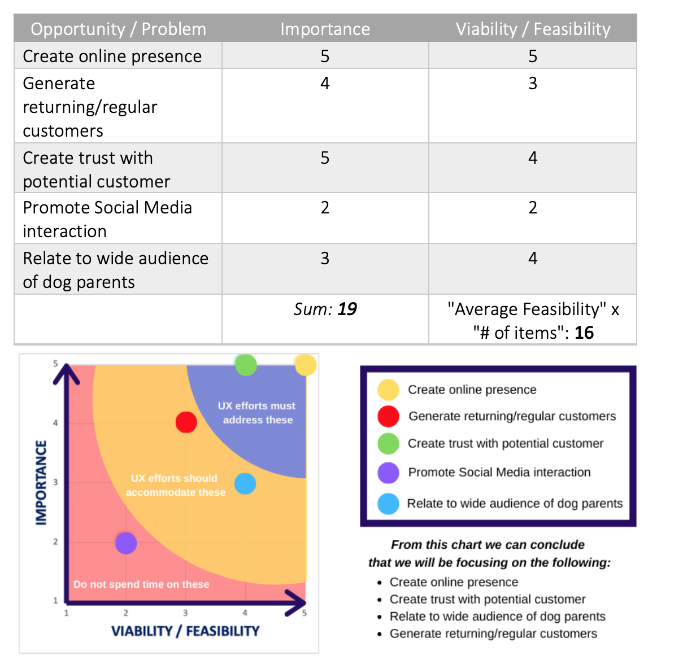
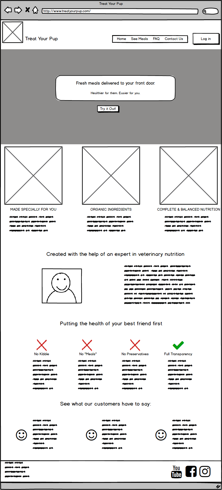
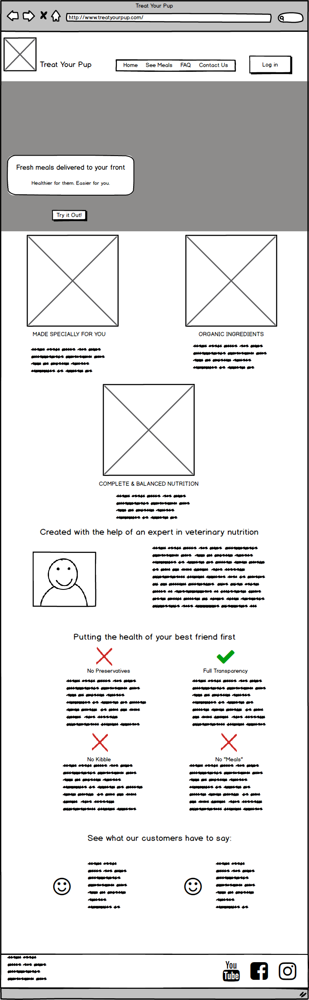
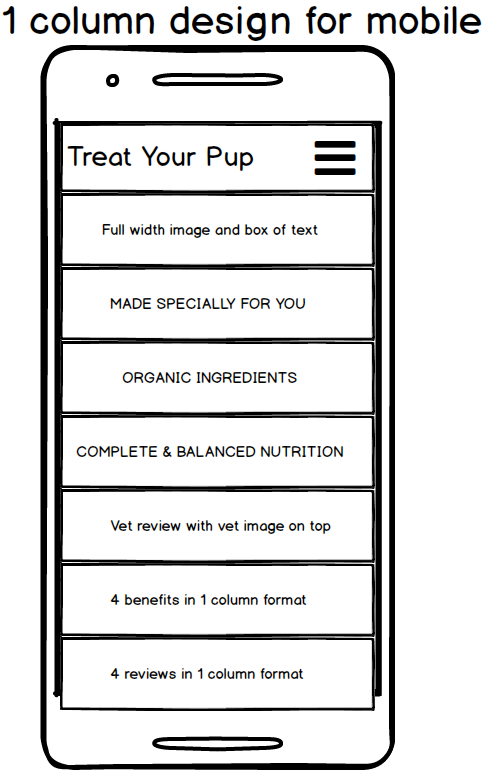

# <i>Treat Your Pup</i> - Milestone Project 1 for Code Institute

Treat Your Pup was created using the skills learned during the first three modules of the Full Stack Web Development course. The goal of this project was to create a mobile-first fully responsive website using HTML, CSS, and Bootstrap.

This website is designed for people who want to feed their dogs healthy and fresh meals but might not have the time to do so every day. The website is built with a simple and straightforward design to make the buying process as quick as possible for customers. People are able to contact the company with questions through a contact form, and can sign up to get a 10% discount on their first order.

Here is a link to the repository: https://github.com/debrawolford/treat-your-pup.git

Here is a link to the live preview: https://debrawolford.github.io/treat-your-pup/

## UX Design

<a href="https://github.com/debrawolford/treat-your-pup/tree/master/wireframes">Click here </a> to see all the wireframes and full UX Design document for this project.

Below is a shorter summary of the UX Design report.

### The Strategy Plane

- The primary business goals are to offer customers a straight-forward and trustworthy buying/registration experience and create a returning customer base.

- The primary audience is dog parents who want to feed their dogs healthy, fresh meals but don't have time to cook every day for them. The audience will most likely primarily be people with full-time jobs ranging in age from early 20's to late 40's.

#### 	What does a user expect?

- What is this/does it have what I want?

Company name will be on all pages. When going to the "See Meals" page there will be detailed information on the ingredients in each type of meal. Social Section at bottom of homepage with posts tagged #treatyourpup so potential customers can see the meals in action (this has not been implemented yet as the company does not have a following on Instagram).

- How can find out more?

Have an FAQ page accessible via the nav bar at the top.

- How can I contact someone?

Have contact details in the footer, the phone number at the top of the page, and a complete contact page with a form.

- What actions are available?

Options such as: Order Now, One Week Trial, Find Out More, Look at user testimonies.

- Can I trust this website?

The Social Sharing, vet testimony and contact sections should offer a level of trust.

#### Importance vs. Feasibility

### The Scope Plane

#### What does the user say they need?

A professional, straightforward website will all the relevant information they need to trust the product for their dog. An area where they can see what people are saying about the product on social media and an easy to access contact section in case they have any concerns.

#### What does the user actually need?

A mobile first website that will allow users to easily navigate the website on all screen sizes. A log in section to make orders for returning customers easier. Transparency on the sourcing of ingredients and manufacturing process.

#### What doesn't the user know that they need?

Regulations, Privacy Policy, Data Security, Veterinary Accreditation, Return Policy in case they or their dogs are not satisfied with the product.

### The Structure Plane

The website will have a traditional navigation bar at the top of each page with the common "Tree Structure". There will be the Home page (index.html), See Meals, Contact Us, FAQ, and a Log In as part of the navigation. On the right side there will be a trial button for first-time customers. This nav bar will collapse into a "hamburger" icon on smaller devices to clear up screen space and bring familiarity to the website as it is common practice on other sites.

### The Skeleton Frame

Below are the three wireframes for the home page. <a href="https://github.com/debrawolford/treat-your-pup/tree/master/wireframes">Click here </a> to see all the wireframes for this project.

## Features

### Existing Features

- Fully interactive navigation bar and footer: Allows users to easily navigate through website without needing to use the back button in the browser. The navigation bar items all have the "active" class from Bootstrap so users can easily see which page they are currently viewing.
- A contact form: The form builds a sense of trust for potential customers as it gives them the opportunity to get in touch regarding any questions they might have. All fields are set to required so the form will not be submitted unless they are all filled out.
- FAQ page: This page answers some of the common questions asked by customers so that they don't need to get in touch if their question is listed.
- Social icons: The social icons are located at the bottom of the page and encourages users to stay active with Treat Your Pup on Social Media.
- Meals page: The meals page shows all of the current recipes offered and a short description of them. There is also an option to mix and match meals in case a customer isn't sure which meal their dog will prefer.
- 10% sign up button: Although it is not fully functioning yet as the website is currently static, when a user selects this button a form will pop up allowing the user to create an account in order to get 10% off on their first order.
-  Mobile responsiveness: The website has been designed with both mobile and desktop users in mind. Many of the images disappear when viewing the website from a small screen in order to save space. The navigation bar collapses into a mobile-friendly icon known as a "hamburger" icon, and the "Try it Out" button disappears on mobile screens as well.
- All images have an alt tag for screen readers and in case the image doesn't load properly.
- A modal pops up when users select "Order" on the Meals page. This lets them know that we are currently not accepting any orders.
- All external links have a target="blank" attribute which will pop open a new window so they don't leave the website.

### Hopeful Future Features

- Order page: At the moment when wanting to order any of the meals by selecting the order button, users get an error modal. This will be hopefully be updated in the future to include an order process that allows users to select how many calories they need, for how many days, etc.
- More FAQ answers: Currently there are only the most basic questions and answers. But as we learn what customers ask about we will start adding more questions and answers.
- An easier to navigate FAQ page: To make finding answers easier, a search bar and some sort of navigation system on the FAQ page would be a necessary addition.
- User Accounts: Due to a lack of knowledge in back end development there are no pages regarding user accounts yet. But the goal is to give customers the option to create an account in order to make future orders simpler and quicker and to be able to get the 10% discount.
- I tried adding a modal letting the user know that their contact form had been submitted, but unfortunately it popped up even when the fields weren't filled out. So leaving this for a later date.

## Technologies Used

- HTML: This was the language used to add all the content to the pages.
- CSS: Cascading Style Sheets language used to style all the pages and improve the user experience.

### Tools

- <a href="https://www.getbootstrap.com">Bootstrap</a>: Used for initial styling and in order to create a uniform website that renders well on all screen sizes. Also used for some basic Javascript additions.
- <a href="https://www.atom.io"> Atom</a>: The code editor used for this project.
- <a href="https://git-scm.com"> Git</a>: Installed on Atom as a plugin to allow version control.
- <a href="https://balsamiq.com/"> Balsamiq Mockups </a>: Used to create the wireframes during the UX Design process.
- Chrome Developer Tools: Used to test the website while developing.
- <a href="https://autoprefixer.github.io/"> Autoprefixer</a>: Added vendor prefixes to CSS for different browsers.
- <a href="https://jigsaw.w3.org/css-validator/"> W3C Markup Validation Jigsaw</a>: To validate the CSS code.
- <a href="https://validator.w3.org/"> W3C Markup Validation</a>: To validate the HTML code.
- <a href="https://www.pixabay.com">Pixabay</a>: Free online images. Used for all images on website other than logo.
- <a href="https://colorsupplyyy.com/app/"> Color Picker</a>: The blue and yellow accent colors used on this website were matched together using Color Picker.
- <a href="https://www.github.com"> Github</a>: Used to host the repositories for this project and the live website preview.
- <a href="https://www.canva.com"> Canva </a>: Used to resize images and create logo.
- <a href="https://fonts.google.com/"> Google Fonts </a>: Used to get two fonts on the website (Dancing Script and Lato).
- <a href="https://www.favicon-generator.org/"> Favicon </a>: Used to generate favicons of the logo.
- <a href="https://fontawesome.com/"> Font Awesome </a>: All icons on the website come from Font Awesome.

## Testing

Chrome Developer Tools was used the entirety of my project to test out how the website rendered on different viewports/devices. By using the device selector I went through each screen size to confirm that everything looked correct each time. If something wasn't rendering properly, I would first edit the code within Chrome Developer to see my changes as I typed them. Once the issue was resolved, I would add it to my code in Atom.

Currently the website has been tested in both Google Chrome and Safari. Everything renders well on Safari for desktop, but on Safari and Google Chrome for mobile the background image at the top of the home page isn't showing up. In Google Chrome for desktop there was an issue with the top of the same background image being cut off by the navbar and looking strange. But with the help of Anthony from the Slack community the navbar issue has been resolved by putting the navbar in a header tag and adding 70px top-margin. Unfortunately, even after resizing the mobile images and making sure the files weren't too large, the image is still not appearing on mobile.

During the mid project review with my mentor, it was suggested to add a pop up modal to the order buttons on the Meals page to let users know that the website is still under maintenance. This was then added to the website.

- Contact Form:
1. Clicked on "Contact Us"
2. Tried submitting the form empty but received an error message asking to fill in data.
3. Tried to submit the form by filling in something other than an email address in the email form but received an error message asking me to put in a valid email address.
4. Tried submitting form with all fields filled in correctly and received no error message.

- Modal form: Same as contact form.

- Navigation bar and Footer:
1. Tried selecting all options while on the Home page to see if they lead to the corresponding pages: success
2. Tried selecting all options while on the Meals page to see if they lead to the corresponding pages: success
3. Tried selecting all options while on the FAQ page to see if they lead to the corresponding pages: success
4. Tried selecting all options while on the Contact Us page to see if they lead to the corresponding pages: success

- Social buttons:
1. When selecting Facebook icon it directs to facebook.com in a new tab.
2. When selecting Instagram icon it directs to instagram.com in a new tab.
3. When selecting Twitter icon it directs to twitter.com in a new tab.

- Order Meals:
1. Clicked on "See Meals".
2. Clicked on any order button on the page.
3. Confirmed that "Sorry! " message pops up when trying to order.
4. Repeated for all "Order" buttons on the page.

W3C Markup Validation was used to ensure that all of the HTML and CSS code matches industry standards:

When testing contact.html: "Document checking completed. No errors or warnings to show."

When testing index.html: Only get error message regarding percentages for image sizes and that I should be using em/px instead. But I have tried both and the images don't render nicely on all sizes so have decided to stick with percentages for now.

When testing meals.html: Same issue with percentages on images as index.html.

When testing faq.html: "Document checking completed. No errors or warnings to show."

When testing style.css: "Congratulations! No Error Found."

### User Stories Testing:

1. I have  a dog that has heavy food allergies and want to find a suitable meal that my dog can eat:
- I scroll down on the home page and read the "Designed for your dog" section.
- I select "Try it Out" and get redirected to the Meals page.
- I scroll down and sees all the different special meals options.
- I press on the Order button for the dairy free option.

2. I have multiple dogs with different preferences and would like to buy a meal for all of them:
- I select Meals Pages.
- I scroll down to Mix and Match and press order so I can combine several meals/caloric needs.
<i>(This could be improved in the future by offering a discount for people with multiple dogs)</i>

3. I work full-time and am rarely home during the day and would like to see if the meals can be delivered in the mornings or evenings:
- I select FAQ page to find out about delivery.
- I scroll down to Shipping and Delivery and read the question/answer letting me know that there flexible delivery options.
-  I click on "See Meals" on the navbar.
- I find the meal that suits my dog and click on Order.

4. I am unhappy with my order and would like to contact someone:
- When on the home page I select FAQ to see if there is information about refunds.
- Under User Account I read that I can indeed get a refund  but need to get in touch.
- I scroll to the bottom of the page and see the info@treatyourpup.com email address.
- I click on it and a new page opens where I can type out my complaint in an email.

## Deployment

Treat Your Pup has been built with the help of Atom, a desktop code editor. It has been committed to Git and Pushed to GitHub using packages within Atom.

### Deploying the website from GitHub

To deploy the website from its GitHub Repository I took these steps:

1. Logged in to Github
2. Navigated to the repository from the Github Dashboard
3. Scrolled to the <i>Settings</i> icon and then down to the <i>Github Pages</i> section
4. Under <i>Source</i>, clicked on the dropdown menu and selected <i>Master Branch</i>
5. When <i>Master Branch</i> was selected, the page needed to be refreshed
6. The link to website could then be found under the <i>GitHub Pages</i> section with the following text:
 "Your site is published at https://debrawolford.github.io/treat-your-pup/"

### Cloning the repository

Take the following steps to clone the website:

1. Navigate to the repository from the Github Dashboard
2. Select the green button in the top right of the screen that says "Clone or download"
3. Click on the clipboard icon to the right of the URL to copy it
4. Open an Integrated Development Environment (IDE) and head over to the terminal
5. Change the directory to where you want to clone the repository to
6. Execute the following command by pasting in the URL you copied in step 3: git clone https://github.com/debrawolford/treat-your-pup.git
7. Press Enter
8. The site will then be cloned

## Credits

### Content

Both the idea of having a large background image and a pop up modal for the 10% discount modal came from the "Whiskey Drop" mini project. The background image code was modified to fit the style of Treat Your Pup. The initial modal code was taken from Bootstrap and then modified to become a sign-up pop-up.

The initial code for the background image was taken from <a href="https://css-tricks.com/perfect-full-page-background-image/"> CSS Tricks</a> and modified to work with the image used on the site.

The transparency CSS property for the image of the two dogs on the FAQ page was taken from <a href="https://www.w3schools.com/css/css_image_transparency.asp">W3schools</a>.

The hover transitions were used with the guidance of the "Whiskey Drop" mini project and once again adjusted to fit the style of Treat Your Pup.

The names of the veterinarian and the customers were taken from <a href="https://www.mydogsname.com/50-super-clever-dog-names/"> My Dog's Name</a>.

### Media

All the images (other than the logo) on this website were taken from <a href="https://www.pixabay.com">Pixabay</a>, a website that offers free stock images.

## Acknowledgements

Thanks to my mentor, Dick Vlaanderen for offering irreplaceable guidance and advice throughout the project.

Thanks to Mark Otto and Jacob Thornton for initially creating Bootstrap, which helped me immensely with the building blocks of the website.

Thanks to my dog, Teddy, who patiently waits for me to cook for him daily and inspiring me to create this fictitious company.

Thanks to Anthony O' Brien, Simen Daehlin, Anna Greaves and Alan Maher from the Slack Community for helping me by looking at the project and giving me valuable feedback and suggestions.
