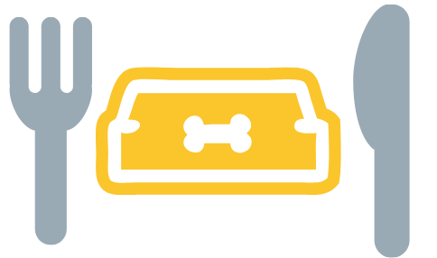

# <i>Treat Your Pup</i> - Milestone Project 1 for Code Institute

 
Treat Your Pup was created using the skills learned during the first three modules of the Full Stack Web Development course. The goal of this project was to create a mobile-first fully responsive website using HTML, CSS, and Bootstrap.

This website is designed for people who want to feed their dogs healthy and fresh meals but might not have the time to do so every day. The website is built with a simple and straightforward design to make the buying process as quick as possible for customers. People are able to contact the company with questions through a contact form, and can sign up to get a 10% discount on their first order.

## UX Design

<a href="https://github.com/debrawolford/treat-your-pup/blob/master/assets/ux-design/ux-design-for-treat-your-pup.pdf">Click here </a> to read the full UX Design report and see the wireframes for this project.

## Features

### Existing Features

- Fully interactive navigation bar and footer: Allows users to easily navigate through website without needing to use the back button in the browser. The navigation bar items all have the "active" class from Bootstrap so users can easily see which page they are currently viewing.
- A contact form: The form builds a sense of trust for potential customers as it gives them the opportunity to get in touch regarding any questions they might have. All fields are set to required so the form will not be submitted unless they are all filled out.
- FAQ page: This page answers some of the common questions asked by customers so that they don't need to get in touch if their question is listed.
- Social icons: The social icons are located at the bottom of the page and encourages users to stay active with Treat Your Pup on Social Media.
- Meals page: The meals page shows all of the current recipes offered and a short description of them. There is also an option to mix and match meals in case a customer isn't sure which meal their dog will prefer.
- 10% sign up button: Although it is not fully functioning yet as the website is currently static, when a user selects this button a form will pop up allowing the user to create an account in order to get 10% off on their first order.
-  Mobile responsiveness: The website has been designed with both mobile and desktop users in mind. Many of the images disappear when viewing the website from a small screen in order to save space. The navigation bar collapses into a mobile-friendly icon known as a "hamburger" icon, and the "Try it Out" button disappears on mobile screens as well.
- All images have an alt tag for screen readers and in case the image doesn't load properly.

### Hopeful Future Features

- Order page: At the moment when wanting to order any of the meals by selecting the order button, nothing happens. This will be updated in the future to include an order process.
- More FAQ answers: Currently there are only the most basic questions and answers. But as we learn what customers ask about we will start adding more questions and answers.
- User Accounts: Due to a lack of knowledge in back end development there are no pages regarding user accounts yet. But the goal is to give customers the option to create an account in order to make future orders simpler and quicker.

## Technologies Used

- HTML5: This was the language used to add all the content to the pages.
- CSS3: Cascading Style Sheets language used to style all the pages and improve the user experience.
- <a href="https://www.getbootstrap.com">Bootstrap version 4.3</a>: Used for initial styling and in order to create a uniform website that renders well on all screen sizes. Also used for some basic Javascript additions.
- <a href="https://www.pixabay.com">Pixabay</a>: Free online images. Used for all images on website other than logo.
- <a href="https://www.canva.com"> Canva </a>: Used to resize images an create logo.
- <a href="https://www.atom.io"> Atom</a>: The code editor used for this project.
- <a href="https://git-scm.com"> Git</a>: Installed on Atom as a plugin to allow version control.
- <a href="https://www.github.com"> Github</a>: Used to host the repositories for this project and the live website preview.
- <a href="https://colorsupplyyy.com/app/"> Color Picker</a>: The two colors used on this website were matched together using this website.
- <a href="https://balsamiq.com/"> Balsamiq Mockups 3</a>: Used to create the wireframes during the UX Design process.
- Chrome Developer Tools: Used to test the website while developing.

## Testing

Chrome Developer Tools was used the entirety of my project to test out how the website rendered on different viewports/devices. By using the device selector I went through each screen size to confirm that everything looked correct each time. If something wasn't rendering properly, I would first edit the code within Chrome Developer to see my changes as I typed them. Once the issue was resolved, I would add it to my code in Atom.

Currently the website has been tested in both Google Chrome and Safari. Everything renders well on Safari for desktop, but on Safari for mobile the background image at the top of the home page is pushing too far to the left and only shows a gray background. In Google Chrome for desktop there is an issue with the top of the same background image being cut off and looking strange. A large amount of time has gone into fixing both issues, so for now I have decided to let it be until a future time.

W3C Markup Validation was used to ensure that all of the HTML and CSS code matches industry standards.

### User Stories Testing:

1. Someone with a dog that has heavy food allergies:
- Scrolls down on home page and reads the "Designed for your dog" section.
- Selects "Try it Out" and heads to the Meals page.
- Scrolls down and sees all the different special meals options.
- Presses order on the option that works best for his/her dog.

2. Someone with multiple dogs:
- Selects Meals Pages
- Scrolls down to Mix and Match to choose multiple meals per dog.
<i>(This could be improved in the future by offering a discount for people with multiple dogs)</i>

2. Someone who works full-time and is rarely home during the day:
- Selects FAQ page to find out about delivery
- Scrolls down to Shipping and Delivery and sees that there is flexible delivery plans.

## Deployment

## Credits

### Content

Both the idea of having a large background image and a pop up modal for the 10% discount modal came from the "Whiskey Drop" mini project. But both were heavily modified to fit the style of this project.

The initial code for the background image was copied from <a href="https://css-tricks.com/perfect-full-page-background-image/"> CSS Tricks</a> and modified to work with the image used on the site.

The hover transitions were used with the guidance of the "Whiskey Drop" mini project and once again adjusted to fit the style of Treat Your Pup.

The names of the veterinarian and the customers were taken from <a href="https://www.mydogsname.com/50-super-clever-dog-names/"> My Dog's Name</a>.

### Media

All the images (other than the logo) on this website were taken from <a href="https://www.pixabay.com">Pixabay</a>, a website that offers free stock images.

## Acknowledgements

Thanks to my mentor, Dick Vlaanderen for offering irreplaceable guidance and advice throughout the project.

Thanks to Mark Otto and Jacob Thornton for initially creating Bootstrap, which helped me immensely with the building blocks of the website.

Thanks to my dog, Teddy, who patiently waits for me to cook for him daily and inspiring me to create this fictitious company.
